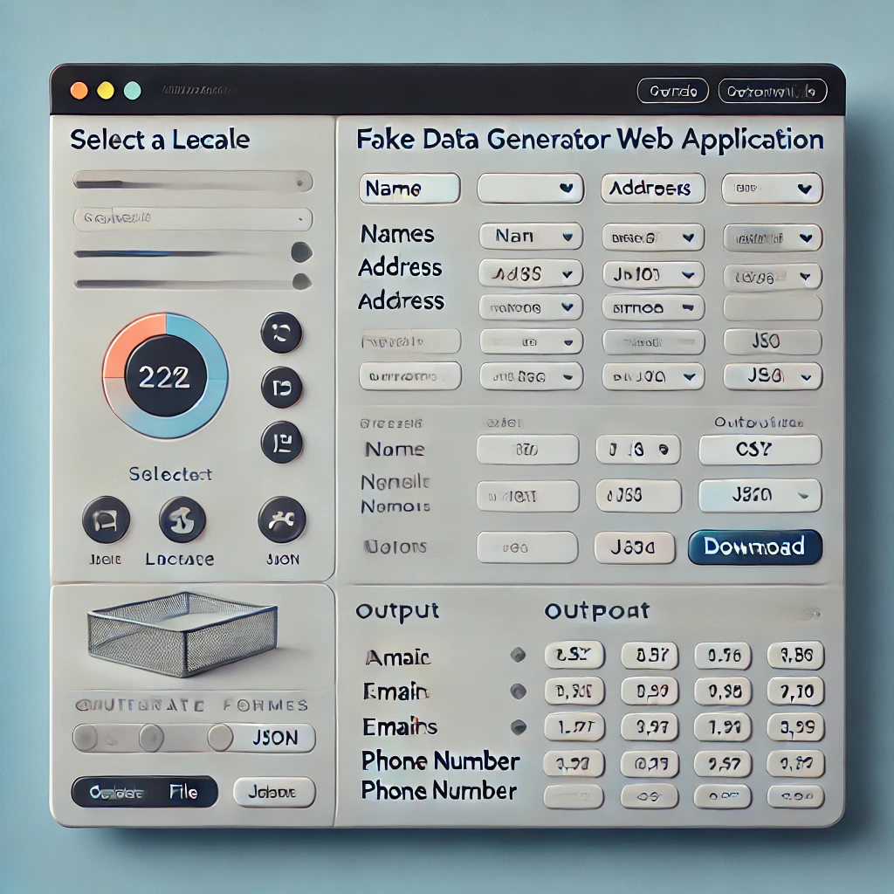

# Fake Dataset Creator




This project is a web application built with **Streamlit** to generate fake datasets. The application allows users to select fields such as names, addresses, emails, phone numbers, etc., and generate fake data based on their selections. Additionally, the app provides an option to choose the output format (CSV, JSON, or JSONL) and supports different locales (e.g., `en_US`, `de_DE`, `fr_FR`, etc.).

## Features

- Select multiple fields to generate fake data (e.g., Name, Address, Email, Job, etc.).
- Choose from multiple output formats: **CSV**, **JSON**, or **JSONL**.
- Select the locale for Faker (e.g., English, French, German, Spanish, etc.).
- Easy-to-use interface built with **Streamlit**.

## Getting Started

### Prerequisites

1. **Docker**: Ensure that you have Docker installed. You can download it from [here](https://www.docker.com/get-started).

2. **Streamlit, Faker, Pandas**: These libraries are required to run the app locally. If you're not using Docker, you can install them with the following command:
   
   ```bash
   pip install streamlit faker pandas
   ```

### Building the Docker Image

To build the Docker image, run the following command from the root directory of the project:

```bash
docker build --tag fake_dataset_builder:latest .
```

This will create a Docker image named `fake_dataset_builder`.

### Running the Docker Container

To run the application in a Docker container, use the following command:

```bash
docker run -d --name fake_dataset_builder -p 8501:8501 fake_dataset_builder:latest
```

This command will run the container in the background, map port 8501 of the container to port 8501 on your machine, and start the Streamlit application.

### Accessing the Application

Once the Docker container is running, open a web browser and go to:

```
http://localhost:8501
```

This will load the Streamlit interface where you can select the fields to include in your dataset, choose the locale, set the number of records to generate, and download the generated file.

### GitHub Repository

You can find the source code and contribute to the project at:

[Fake Dataset Creator GitHub Repository](https://github.com/We4TechAI/Fake-Dataset-Creator.git)

## Example Usage

1. **Select Fields**: Choose the fields you want to include (e.g., Name, Address, Email).
2. **Select Locale**: Choose the locale (e.g., `en_US`, `fr_FR`) for the generated data.
3. **Set Number of Records**: Choose how many records you want to generate.
4. **Select Output Format**: Choose between **CSV**, **JSON**, or **JSONL** format.
5. **Generate File**: Click the **Generate File** button, and a download link will appear.
6. **Download File**: Download the generated file and use it for testing or data simulation.

## Local Development

If you prefer to run the application without Docker, you can run it locally by following these steps:

1. Clone this repository:

   ```bash
   git clone https://github.com/We4TechAI/Fake-Dataset-Creator.git
   ```

2. Navigate to the project directory:

   ```bash
   cd Fake-Dataset-Creator
   ```

3. Install the required dependencies:

   ```bash
   pip install -r requirements.txt
   ```

4. Run the Streamlit application:

   ```bash
   streamlit run main.py
   ```

5. Open your web browser and go to [http://localhost:8501](http://localhost:8501) to interact with the app.

## License

This project is licensed under the MIT License - see the [LICENSE](LICENSE) file for details.

## Acknowledgments

- [Streamlit](https://streamlit.io) for building the application interface.
- [Docker](https://www.docker.com) for containerizing the application.


### Explanation:
1. **Project Overview**: Describes what the project is about and its key features.
2. **Prerequisites**: Lists the necessary tools and libraries.
3. **Docker Setup**: Provides instructions on how to build and run the Docker container for the app.
4. **Running Locally**: Explains how to run the app locally without Docker.
5. **Usage Instructions**: Describes how to interact with the app once it's up and running.
6. **GitHub Link**: A link to the GitHub repository where the source code is hosted.
7. **License and Acknowledgments**: Includes information about the project's license and credits.

This README should give users everything they need to get started with your Fake Dataset Creator project, both through Docker and locally.
